<!-- DAILY-CARD-START -->
# 🎴 Daily Featured Namecard

  

---
<!-- DAILY-CARD-END -->

<!-- GALLERY-START -->
---

## 📂 Achievement

<a href="https://github.com/ryokr/Namecard/blob/main/Namecards/Achievement/UI_NameCardPic_Cenyan1_P.png" target="_blank">
  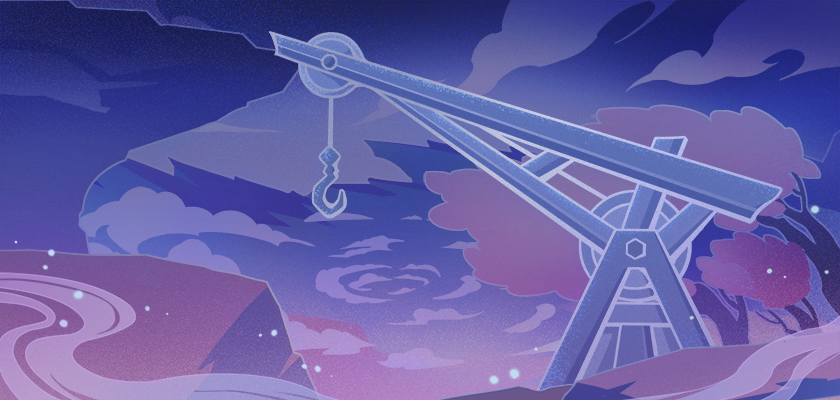
</a>
<a href="https://github.com/ryokr/Namecard/blob/main/Namecards/Achievement/UI_NameCardPic_Chenyu_Adeptal_Valley_P.png" target="_blank">
  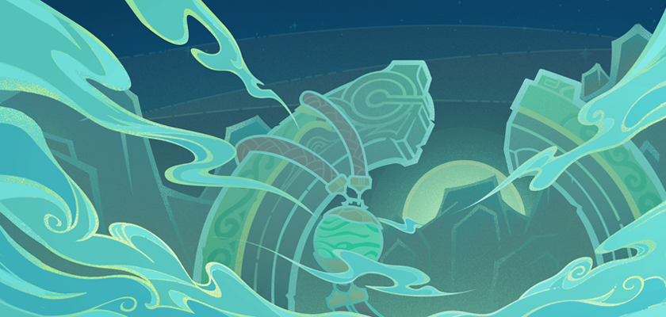
</a>

<a href="https://github.com/ryokr/Namecard/blob/main/Namecards/Achievement/UI_NameCardPic_Csxy3_P.png" target="_blank">
  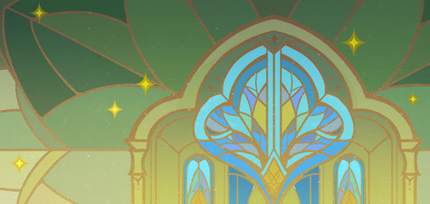
</a>

<a href="https://github.com/ryokr/Namecard/blob/main/Namecards/Achievement/UI_NameCardPic_Csxy5_P.png" target="_blank">
  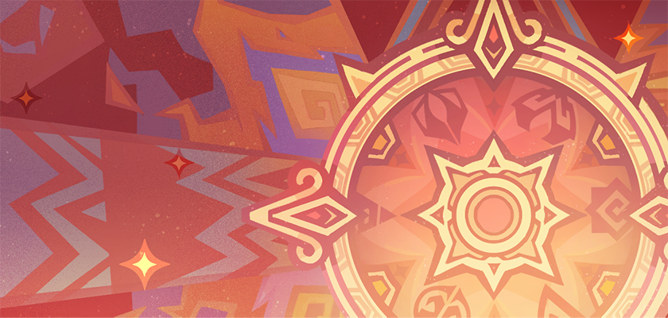
</a>
<a href="https://github.com/ryokr/Namecard/blob/main/Namecards/Achievement/UI_NameCardPic_Csxy6_P.png" target="_blank">
  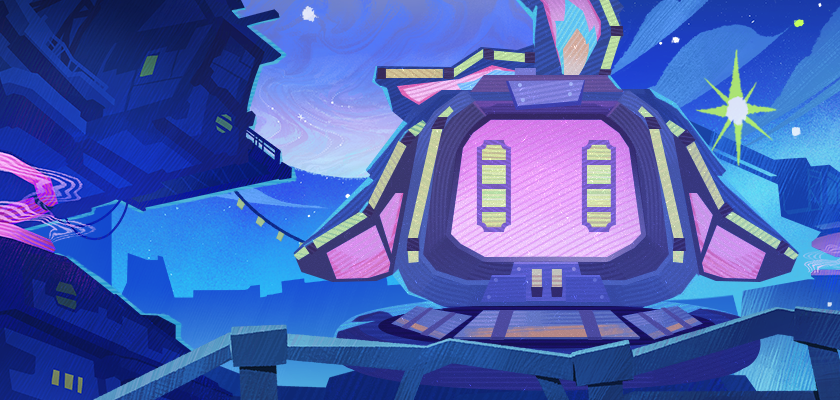
</a>

<a href="https://github.com/ryokr/Namecard/blob/main/Namecards/Achievement/UI_NameCardPic_Daoqi2_P.png" target="_blank">
  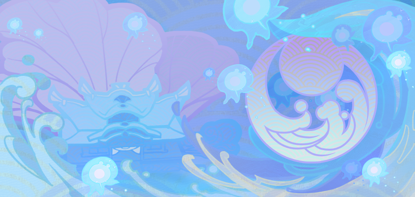
</a>
<a href="https://github.com/ryokr/Namecard/blob/main/Namecards/Achievement/UI_NameCardPic_Daoqi3_P.png" target="_blank">
  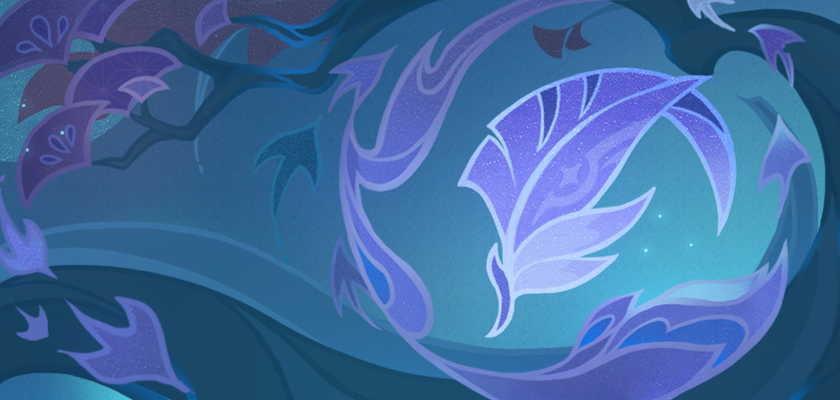
</a>

<a href="https://github.com/ryokr/Namecard/blob/main/Namecards/Achievement/UI_NameCardPic_Dfcq3_P.png" target="_blank">
  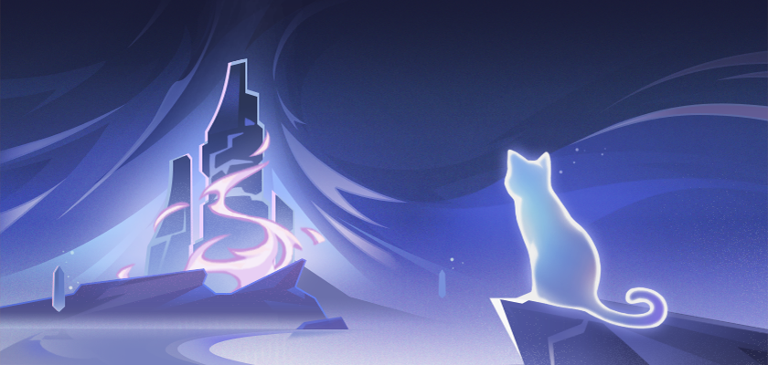
</a>

<a href="https://github.com/ryokr/Namecard/blob/main/Namecards/Achievement/UI_NameCardPic_FD3_P.png" target="_blank">
  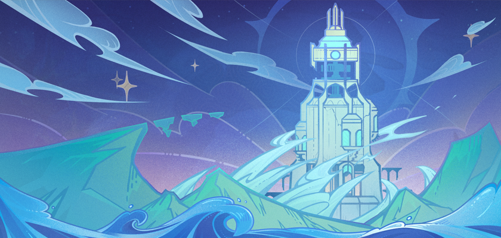
</a>

<a href="https://github.com/ryokr/Namecard/blob/main/Namecards/Achievement/UI_NameCardPic_MusicGame01_P.png" target="_blank">
  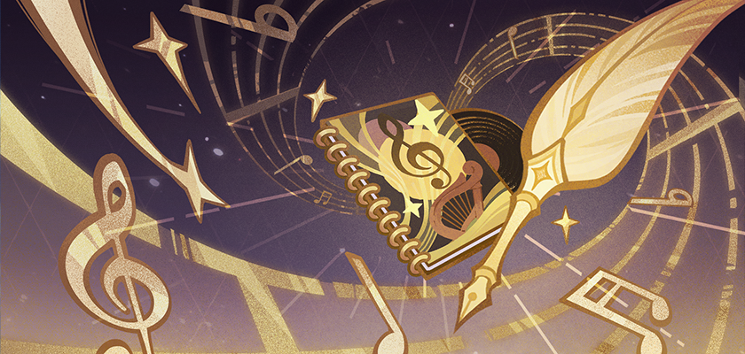
</a>

<a href="https://github.com/ryokr/Namecard/blob/main/Namecards/Achievement/UI_NameCardPic_Natlan3_P.png" target="_blank">
  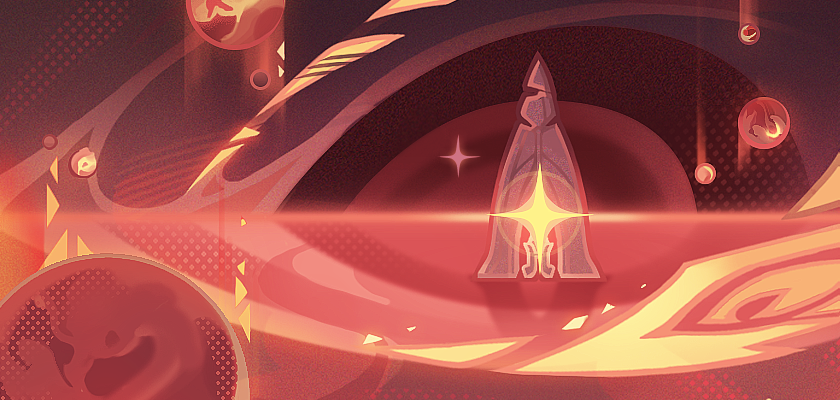
</a>

<a href="https://github.com/ryokr/Namecard/blob/main/Namecards/Achievement/UI_NameCardPic_NodKrai1_P.png" target="_blank">
  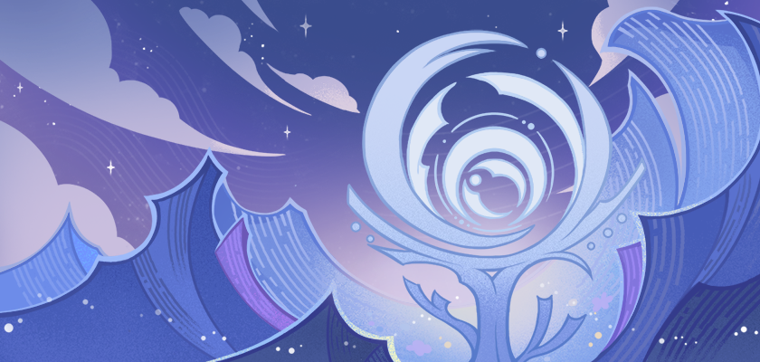
</a>
<a href="https://github.com/ryokr/Namecard/blob/main/Namecards/Achievement/UI_NameCardPic_NodKrai2_P.png" target="_blank">
  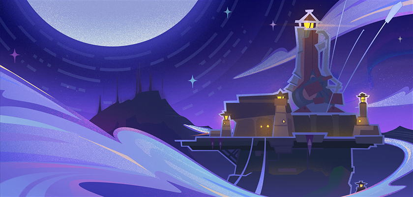
</a>

<a href="https://github.com/ryokr/Namecard/blob/main/Namecards/Achievement/UI_NameCardPic_Sss_P.png" target="_blank">
  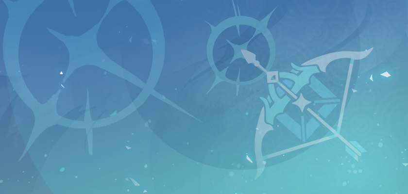
</a>
<a href="https://github.com/ryokr/Namecard/blob/main/Namecards/Achievement/UI_NameCardPic_Tzz10_P.png" target="_blank">
  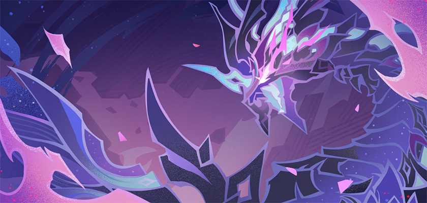
</a>
<a href="https://github.com/ryokr/Namecard/blob/main/Namecards/Achievement/UI_NameCardPic_Tzz1_P.png" target="_blank">
  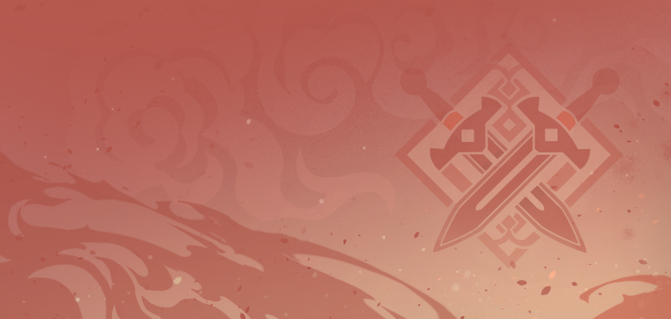
</a>

<a href="https://github.com/ryokr/Namecard/blob/main/Namecards/Achievement/UI_NameCardPic_Tzz4_P.png" target="_blank">
  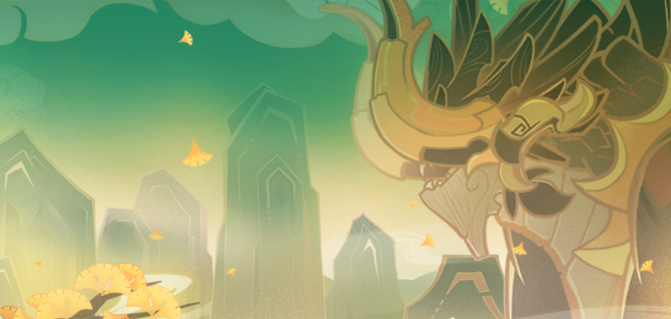
</a>
<a href="https://github.com/ryokr/Namecard/blob/main/Namecards/Achievement/UI_NameCardPic_Tzz5_P.png" target="_blank">
  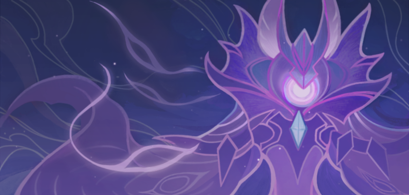
</a>
<a href="https://github.com/ryokr/Namecard/blob/main/Namecards/Achievement/UI_NameCardPic_Tzz6_P.png" target="_blank">
  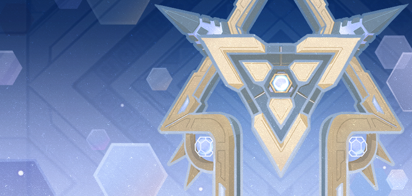
</a>
<a href="https://github.com/ryokr/Namecard/blob/main/Namecards/Achievement/UI_NameCardPic_Tzz7_P.png" target="_blank">
  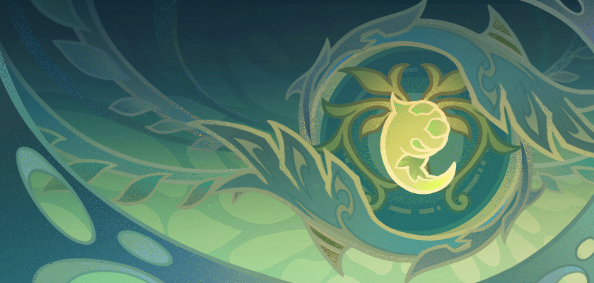
</a>
<a href="https://github.com/ryokr/Namecard/blob/main/Namecards/Achievement/UI_NameCardPic_Tzz8_P.png" target="_blank">
  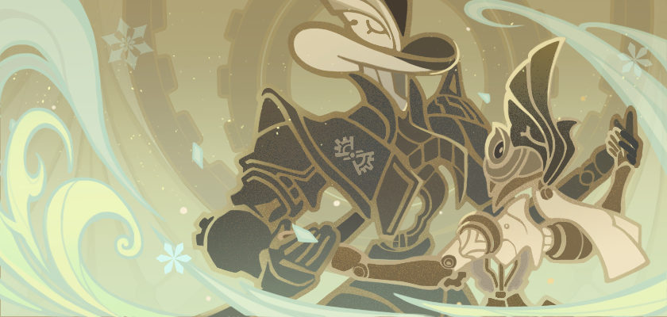
</a>
<a href="https://github.com/ryokr/Namecard/blob/main/Namecards/Achievement/UI_NameCardPic_Whalewrangler_P.png" target="_blank">
  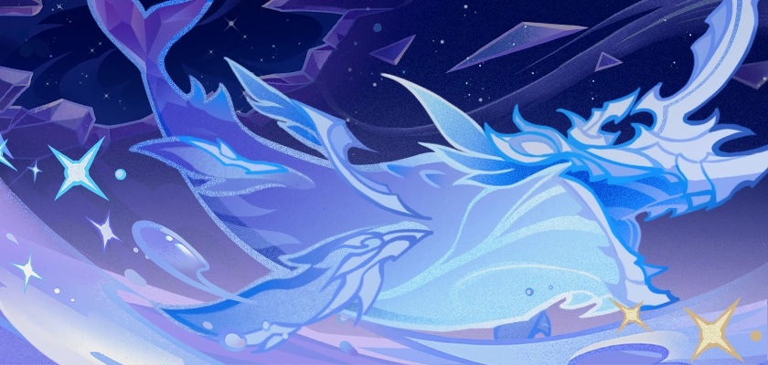
</a>
<a href="https://github.com/ryokr/Namecard/blob/main/Namecards/Achievement/UI_NameCardPic_Xm1_P.png" target="_blank">
  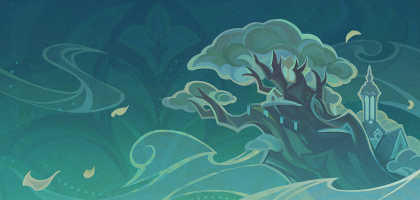
</a>
<a href="https://github.com/ryokr/Namecard/blob/main/Namecards/Achievement/UI_NameCardPic_Xm2_P.png" target="_blank">
  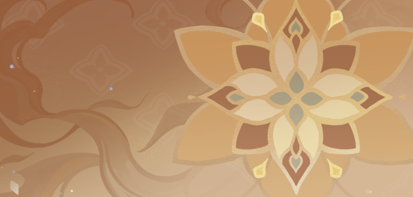
</a>
<a href="https://github.com/ryokr/Namecard/blob/main/Namecards/Achievement/UI_NameCardPic_Xm3_P.png" target="_blank">
  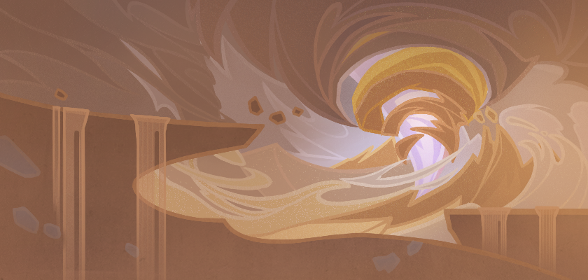
</a>
<a href="https://github.com/ryokr/Namecard/blob/main/Namecards/Achievement/UI_NameCardPic_Xm4_P.png" target="_blank">
  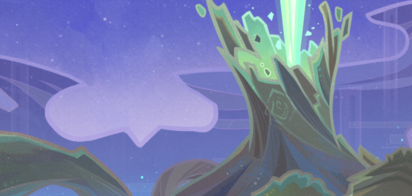
</a>
<a href="https://github.com/ryokr/Namecard/blob/main/Namecards/Achievement/UI_NameCardPic_Xssdlk_P.png" target="_blank">
  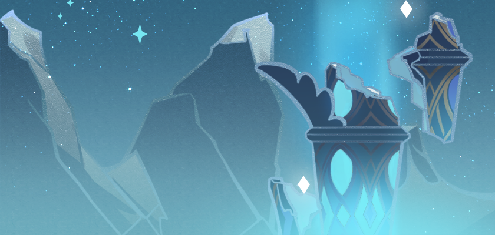
</a>

<a href="https://github.com/ryokr/Namecard/blob/main/Namecards/Achievement/UI_NameCardPic_Ysxf2_P.png" target="_blank">
  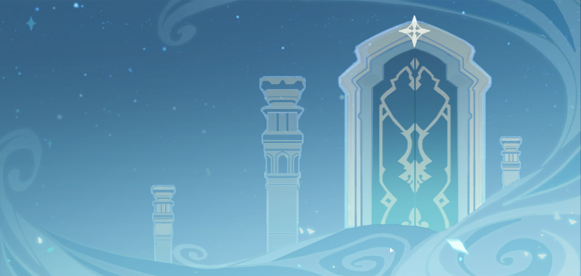
</a>

<a href="https://github.com/ryokr/Namecard/blob/main/Namecards/Achievement/UI_NameCardPic_Ysxf6_P.png" target="_blank">
  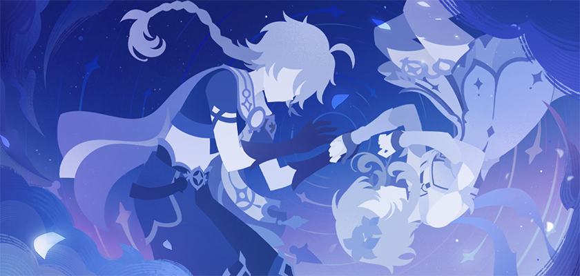
</a>

<a href="https://github.com/ryokr/Namecard/blob/main/Namecards/Achievement/UI_NameCardPic_Yxzl_P.png" target="_blank">
  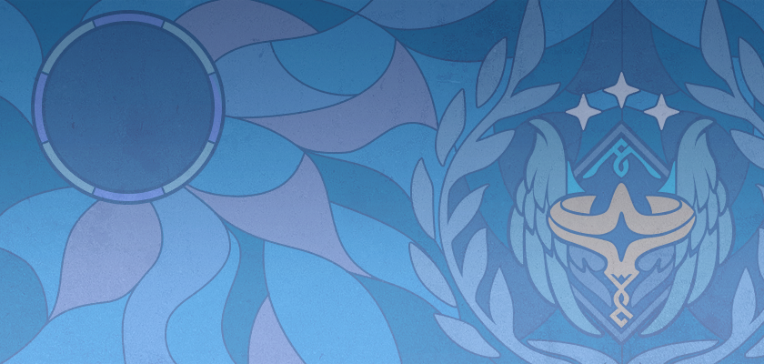
</a>

---

## 📂 Battle Pass

---

## 📂 Character

<a href="https://github.com/ryokr/Namecard/blob/main/Namecards/Character/UI_NameCardPic_Alhaitham_P.png" target="_blank">
  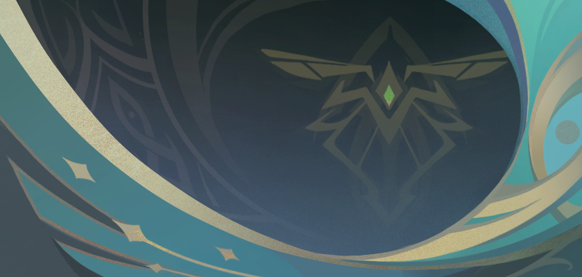
</a>
<a href="https://github.com/ryokr/Namecard/blob/main/Namecards/Character/UI_NameCardPic_Aloy_P.png" target="_blank">
  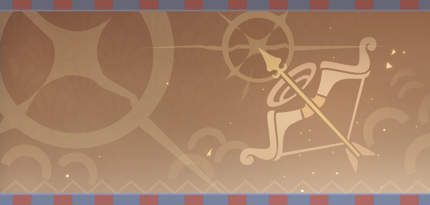
</a>

<a href="https://github.com/ryokr/Namecard/blob/main/Namecards/Character/UI_NameCardPic_Arlecchino_P.png" target="_blank">
  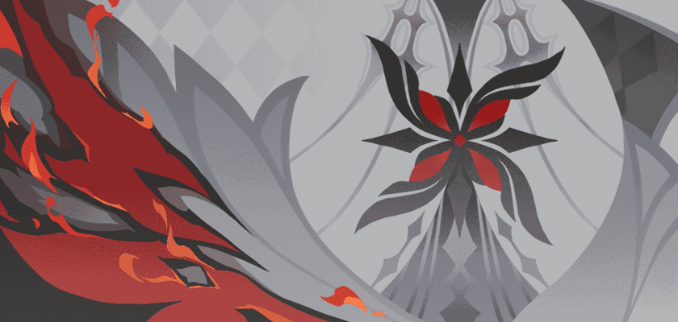
</a>

<a href="https://github.com/ryokr/Namecard/blob/main/Namecards/Character/UI_NameCardPic_Beidou_P.png" target="_blank">
  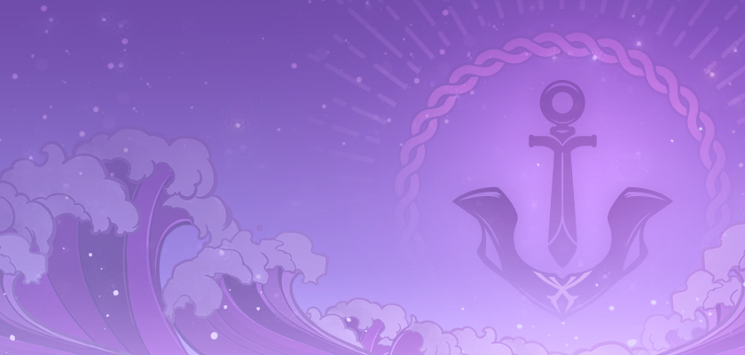
</a>
<a href="https://github.com/ryokr/Namecard/blob/main/Namecards/Character/UI_NameCardPic_Bennett_P.png" target="_blank">
  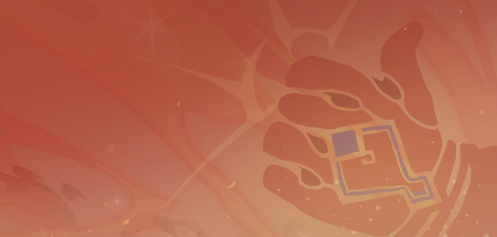
</a>
<a href="https://github.com/ryokr/Namecard/blob/main/Namecards/Character/UI_NameCardPic_Chasca_P.png" target="_blank">
  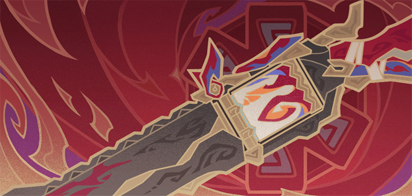
</a>
<a href="https://github.com/ryokr/Namecard/blob/main/Namecards/Character/UI_NameCardPic_Chevreuse_P.png" target="_blank">
  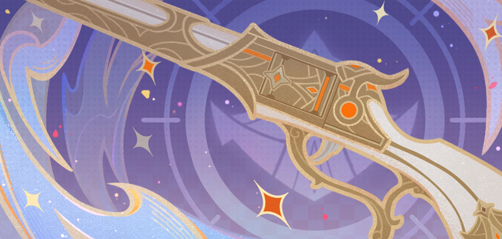
</a>

<a href="https://github.com/ryokr/Namecard/blob/main/Namecards/Character/UI_NameCardPic_Clorinde_P.png" target="_blank">
  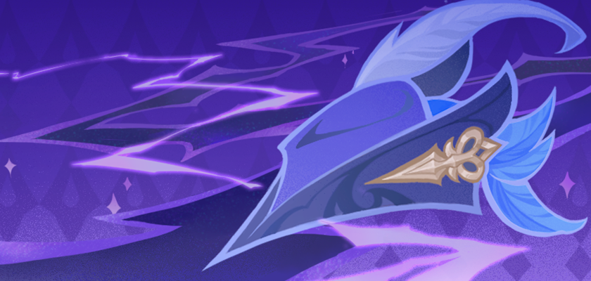
</a>

<a href="https://github.com/ryokr/Namecard/blob/main/Namecards/Character/UI_NameCardPic_Columbina_P.png" target="_blank">
  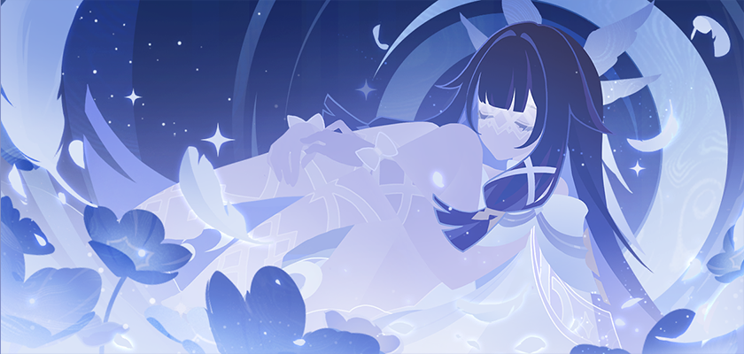
</a>
<a href="https://github.com/ryokr/Namecard/blob/main/Namecards/Character/UI_NameCardPic_Cyno_P.png" target="_blank">
  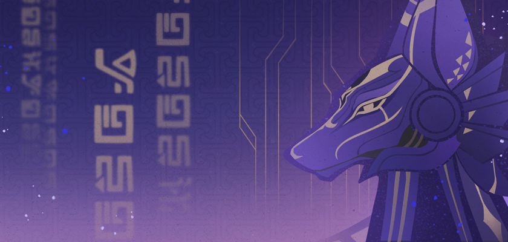
</a>
<a href="https://github.com/ryokr/Namecard/blob/main/Namecards/Character/UI_NameCardPic_Dahlia_P.png" target="_blank">
  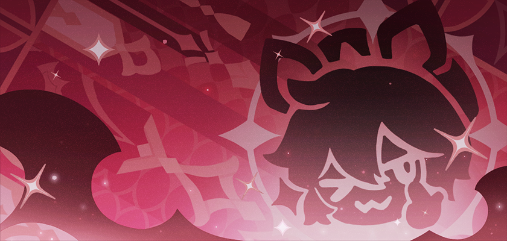
</a>

<a href="https://github.com/ryokr/Namecard/blob/main/Namecards/Character/UI_NameCardPic_Diluc_P.png" target="_blank">
  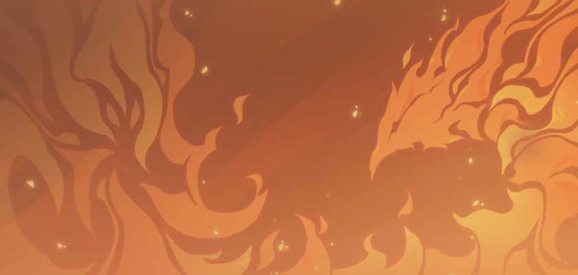
</a>
<a href="https://github.com/ryokr/Namecard/blob/main/Namecards/Character/UI_NameCardPic_Diona_P.png" target="_blank">
  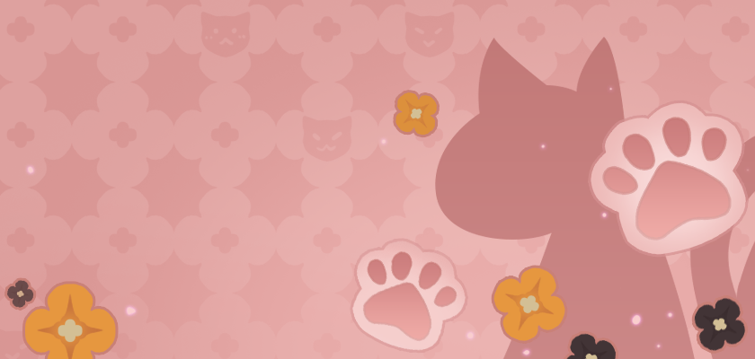
</a>
<a href="https://github.com/ryokr/Namecard/blob/main/Namecards/Character/UI_NameCardPic_Dori_P.png" target="_blank">
  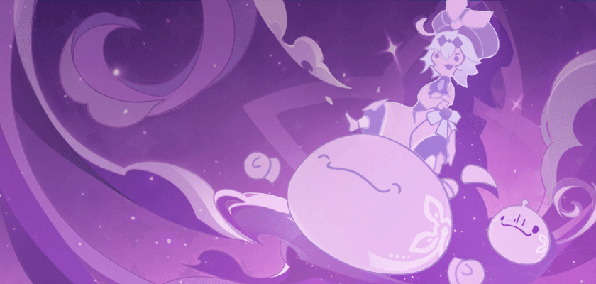
</a>
<a href="https://github.com/ryokr/Namecard/blob/main/Namecards/Character/UI_NameCardPic_Durin_P.png" target="_blank">
  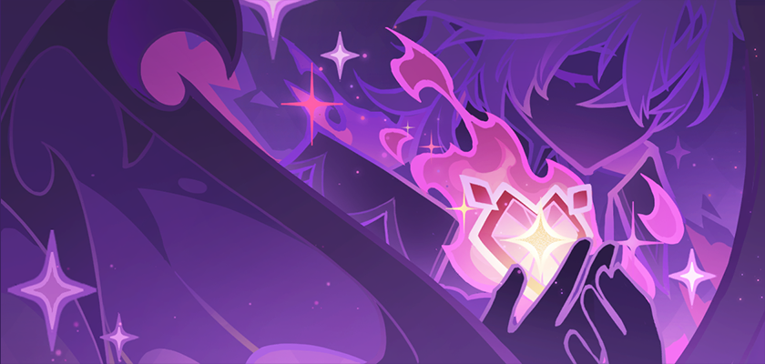
</a>

<a href="https://github.com/ryokr/Namecard/blob/main/Namecards/Character/UI_NameCardPic_Escoffier_P.png" target="_blank">
  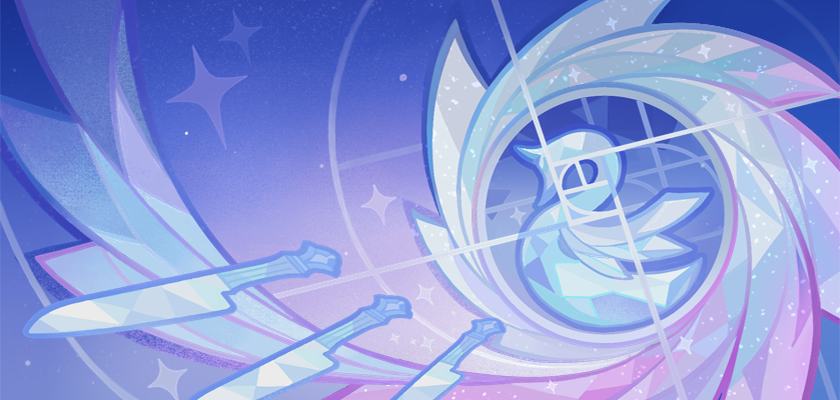
</a>

<a href="https://github.com/ryokr/Namecard/blob/main/Namecards/Character/UI_NameCardPic_Flins_P.png" target="_blank">
  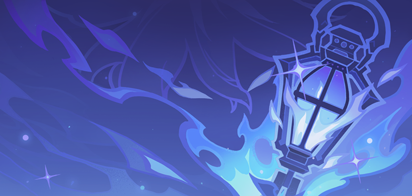
</a>
<a href="https://github.com/ryokr/Namecard/blob/main/Namecards/Character/UI_NameCardPic_Furina_P.png" target="_blank">
  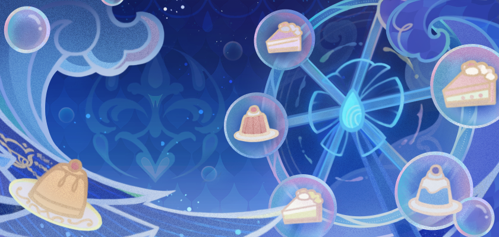
</a>

<a href="https://github.com/ryokr/Namecard/blob/main/Namecards/Character/UI_NameCardPic_Iansan_P.png" target="_blank">
  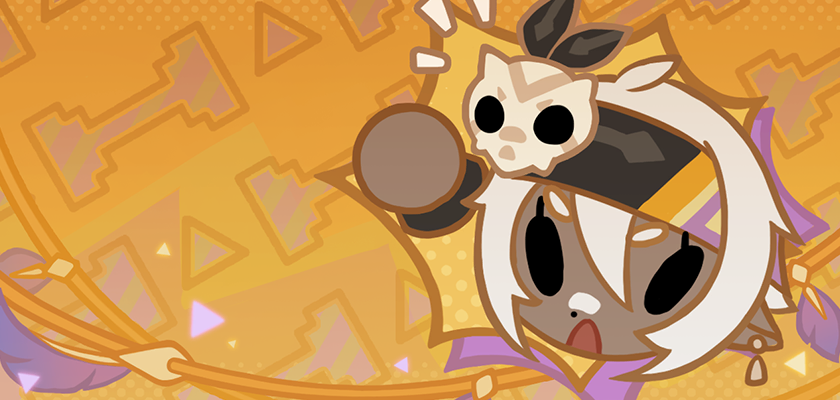
</a>
<a href="https://github.com/ryokr/Namecard/blob/main/Namecards/Character/UI_NameCardPic_Ifa_P.png" target="_blank">
  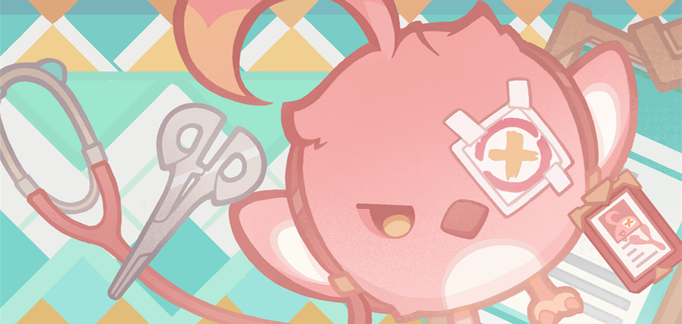
</a>

<a href="https://github.com/ryokr/Namecard/blob/main/Namecards/Character/UI_NameCardPic_Kaveh_P.png" target="_blank">
  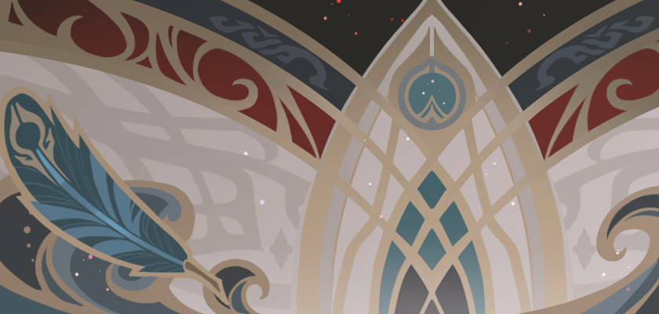
</a>

<a href="https://github.com/ryokr/Namecard/blob/main/Namecards/Character/UI_NameCardPic_Kinich_P.png" target="_blank">
  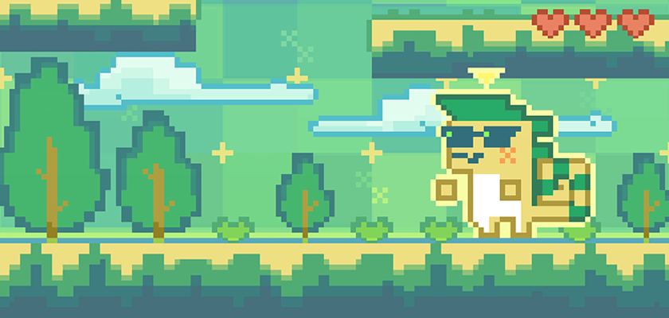
</a>
<a href="https://github.com/ryokr/Namecard/blob/main/Namecards/Character/UI_NameCardPic_Kirara_P.png" target="_blank">
  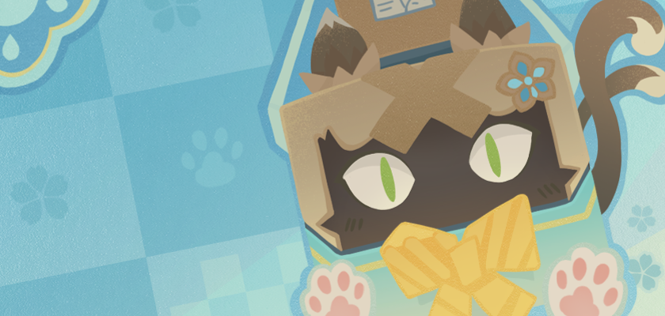
</a>

<a href="https://github.com/ryokr/Namecard/blob/main/Namecards/Character/UI_NameCardPic_Lanyan_P.png" target="_blank">
  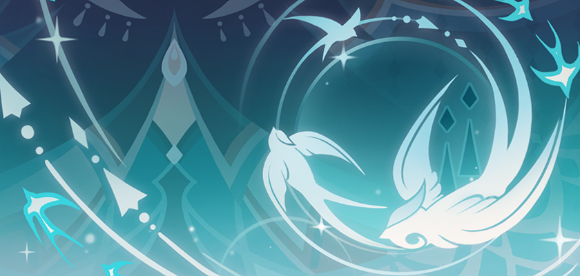
</a>

<a href="https://github.com/ryokr/Namecard/blob/main/Namecards/Character/UI_NameCardPic_Linnea_P.png" target="_blank">
  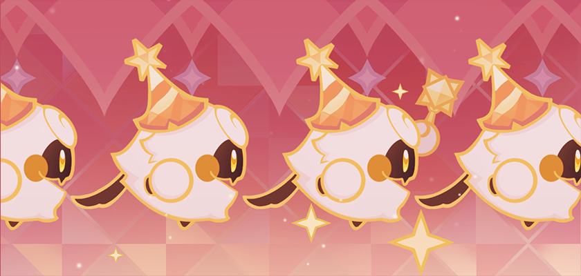
</a>

<a href="https://github.com/ryokr/Namecard/blob/main/Namecards/Character/UI_NameCardPic_Lohen_P.png" target="_blank">
  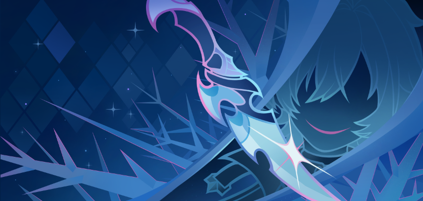
</a>
<a href="https://github.com/ryokr/Namecard/blob/main/Namecards/Character/UI_NameCardPic_Lynette_P.png" target="_blank">
  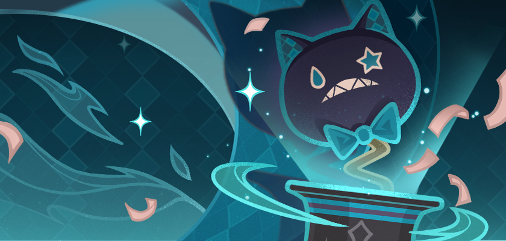
</a>
<a href="https://github.com/ryokr/Namecard/blob/main/Namecards/Character/UI_NameCardPic_Lyney_P.png" target="_blank">
  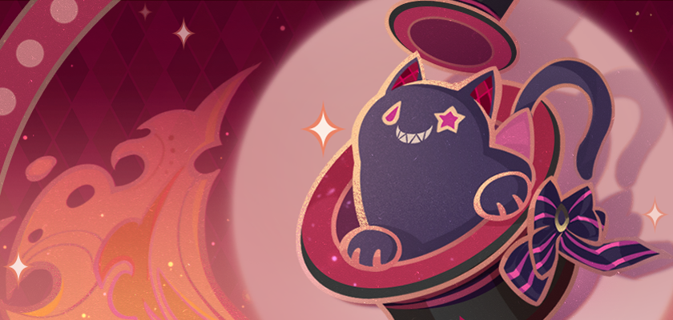
</a>
<a href="https://github.com/ryokr/Namecard/blob/main/Namecards/Character/UI_NameCardPic_MarionetteNew_P.png" target="_blank">
  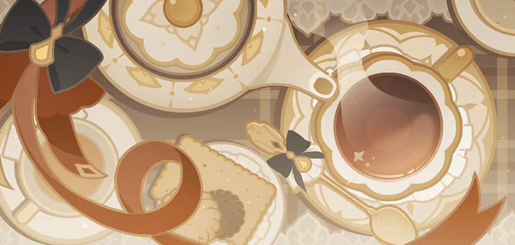
</a>
<a href="https://github.com/ryokr/Namecard/blob/main/Namecards/Character/UI_NameCardPic_Mavuika_P.png" target="_blank">
  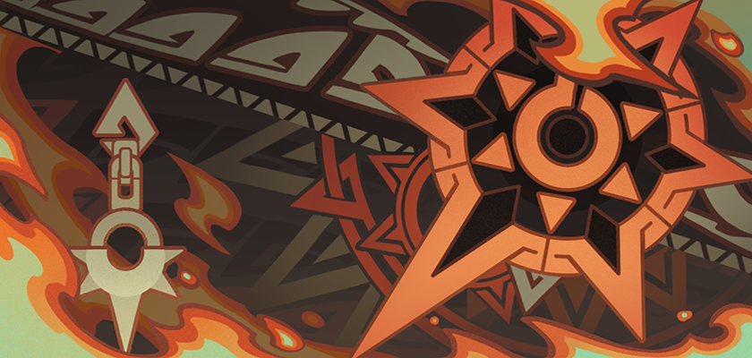
</a>
<a href="https://github.com/ryokr/Namecard/blob/main/Namecards/Character/UI_NameCardPic_Mika_P.png" target="_blank">
  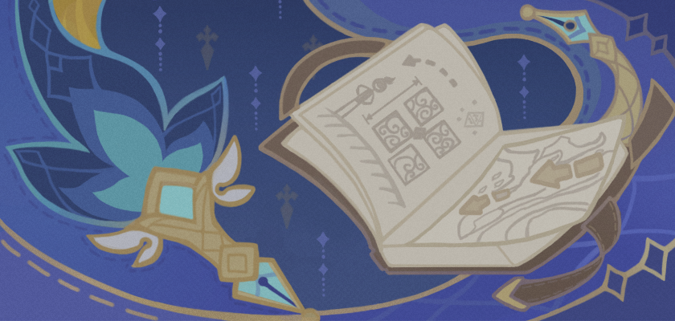
</a>

<a href="https://github.com/ryokr/Namecard/blob/main/Namecards/Character/UI_NameCardPic_Nahida_P.png" target="_blank">
  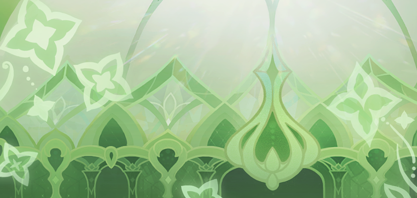
</a>
<a href="https://github.com/ryokr/Namecard/blob/main/Namecards/Character/UI_NameCardPic_Navia_P.png" target="_blank">
  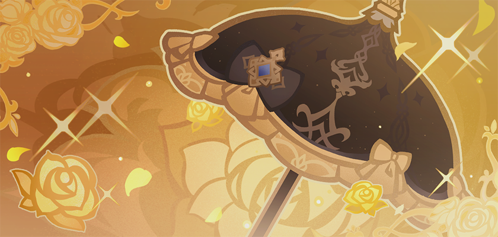
</a>
<a href="https://github.com/ryokr/Namecard/blob/main/Namecards/Character/UI_NameCardPic_Nefer_P.png" target="_blank">
  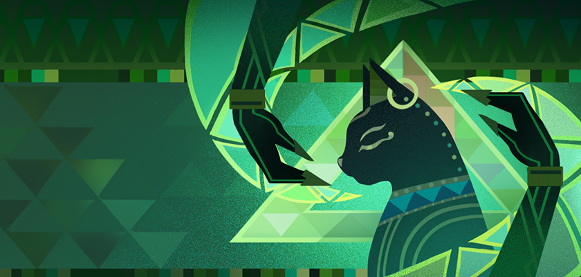
</a>
<a href="https://github.com/ryokr/Namecard/blob/main/Namecards/Character/UI_NameCardPic_Neuvillette_P.png" target="_blank">
  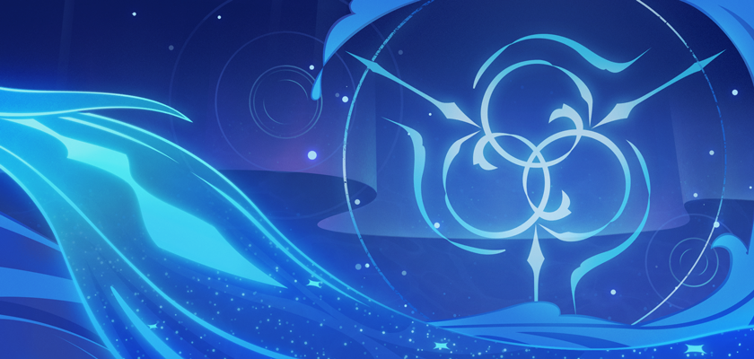
</a>
<a href="https://github.com/ryokr/Namecard/blob/main/Namecards/Character/UI_NameCardPic_Nicole_P.png" target="_blank">
  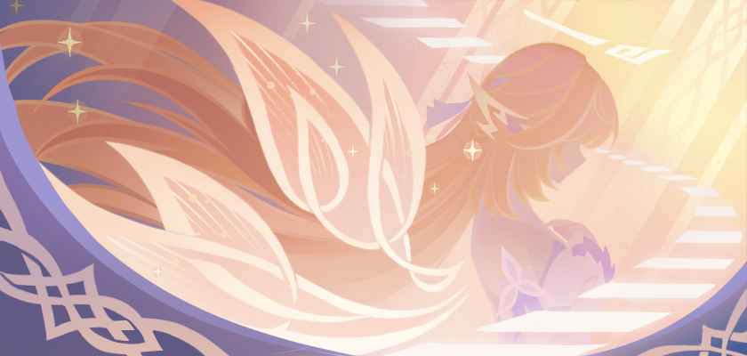
</a>

<a href="https://github.com/ryokr/Namecard/blob/main/Namecards/Character/UI_NameCardPic_Ororon_P.png" target="_blank">
  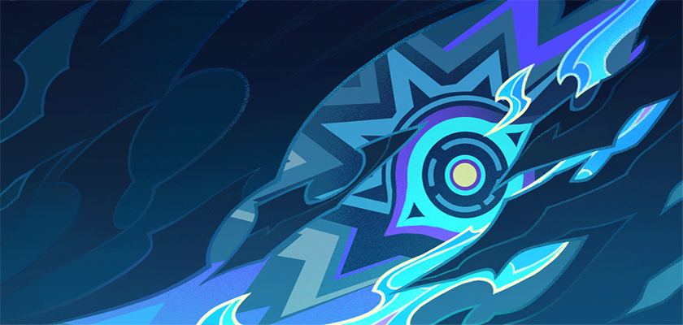
</a>

<a href="https://github.com/ryokr/Namecard/blob/main/Namecards/Character/UI_NameCardPic_Sethos_P.png" target="_blank">
  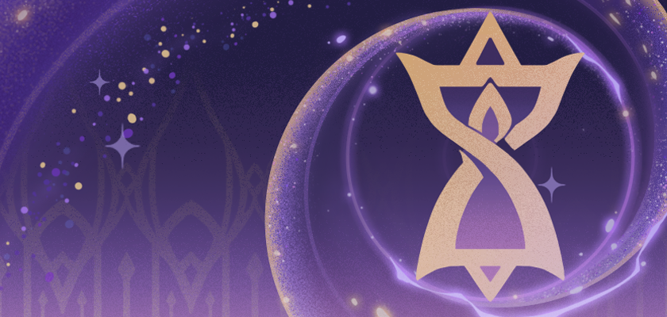
</a>
<a href="https://github.com/ryokr/Namecard/blob/main/Namecards/Character/UI_NameCardPic_Shenhe_P.png" target="_blank">
  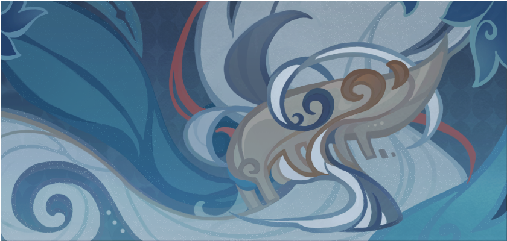
</a>

<a href="https://github.com/ryokr/Namecard/blob/main/Namecards/Character/UI_NameCardPic_Sigewinne_P.png" target="_blank">
  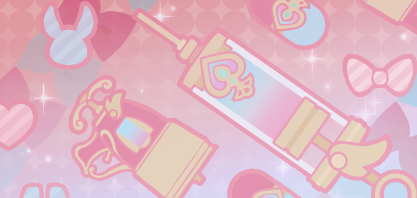
</a>
<a href="https://github.com/ryokr/Namecard/blob/main/Namecards/Character/UI_NameCardPic_SkirkNew_P.png" target="_blank">
  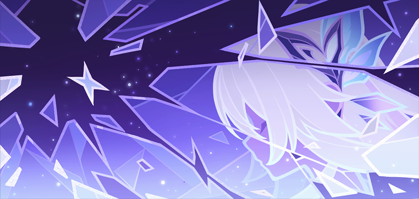
</a>

<a href="https://github.com/ryokr/Namecard/blob/main/Namecards/Character/UI_NameCardPic_Tartaglia_P.png" target="_blank">
  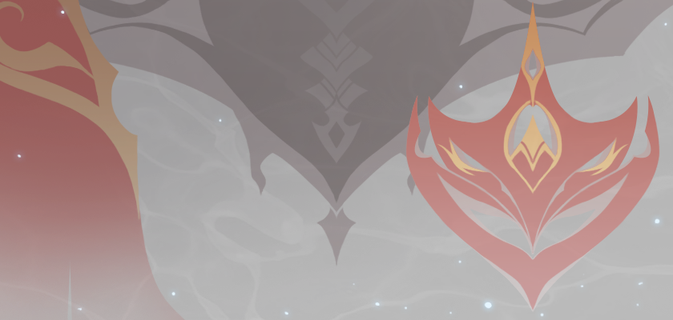
</a>

<a href="https://github.com/ryokr/Namecard/blob/main/Namecards/Character/UI_NameCardPic_Tighnari_P.png" target="_blank">
  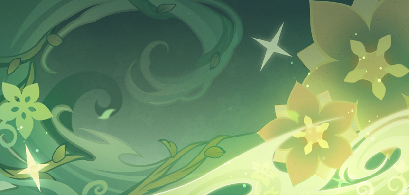
</a>

<a href="https://github.com/ryokr/Namecard/blob/main/Namecards/Character/UI_NameCardPic_Varka_P.png" target="_blank">
  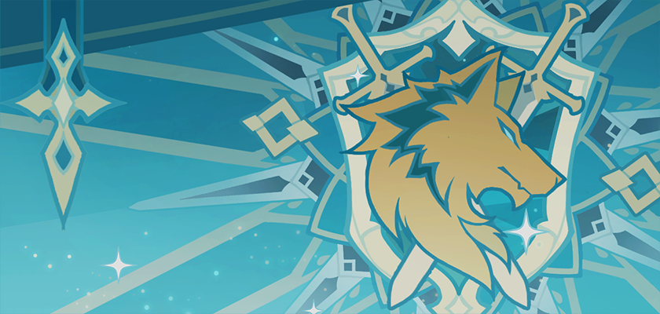
</a>
<a href="https://github.com/ryokr/Namecard/blob/main/Namecards/Character/UI_NameCardPic_Venti_P.png" target="_blank">
  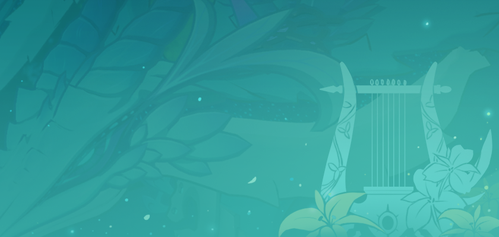
</a>

<a href="https://github.com/ryokr/Namecard/blob/main/Namecards/Character/UI_NameCardPic_Wriothesley_P.png" target="_blank">
  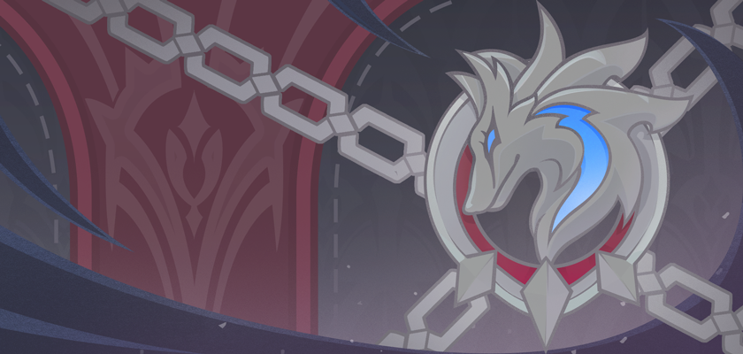
</a>

<a href="https://github.com/ryokr/Namecard/blob/main/Namecards/Character/UI_NameCardPic_Xianyun_P.png" target="_blank">
  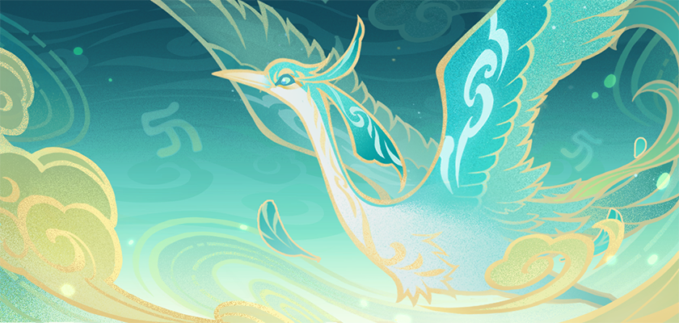
</a>
<a href="https://github.com/ryokr/Namecard/blob/main/Namecards/Character/UI_NameCardPic_Xiao_P.png" target="_blank">
  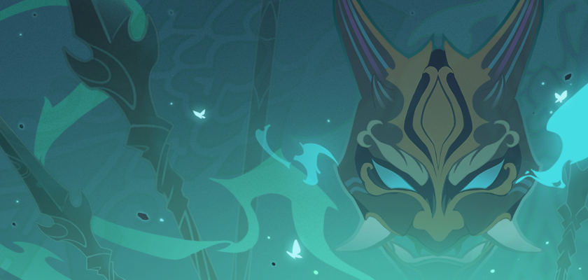
</a>

<a href="https://github.com/ryokr/Namecard/blob/main/Namecards/Character/UI_NameCardPic_Yanfei_P.png" target="_blank">
  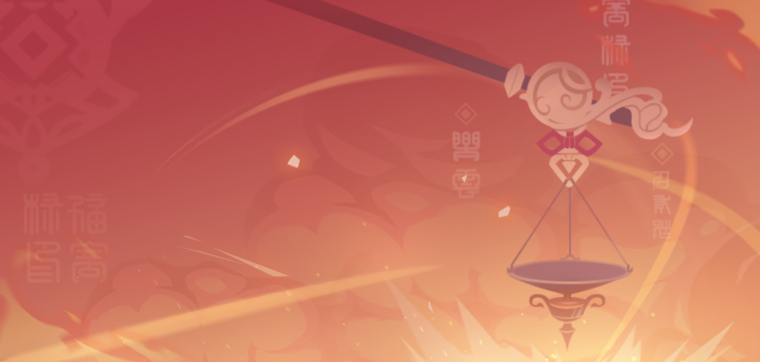
</a>
<a href="https://github.com/ryokr/Namecard/blob/main/Namecards/Character/UI_NameCardPic_Yaoyao_P.png" target="_blank">
  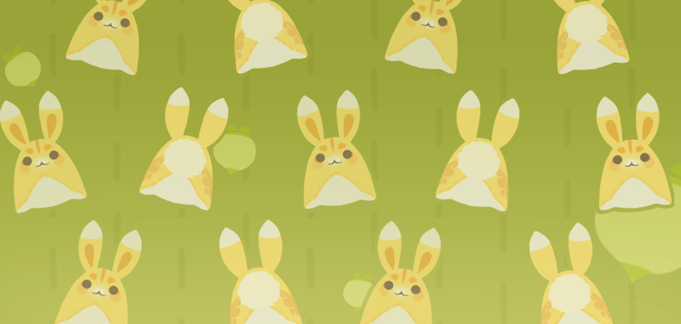
</a>

<a href="https://github.com/ryokr/Namecard/blob/main/Namecards/Character/UI_NameCardPic_Zibai_P.png" target="_blank">
  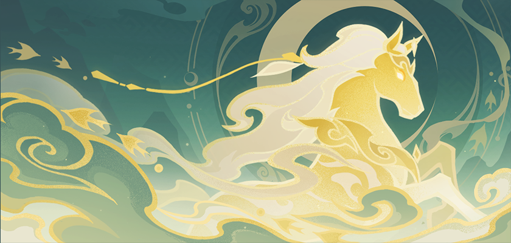
</a>

---

## 📂 Event

<a href="https://github.com/ryokr/Namecard/blob/main/Namecards/Event/UI_NameCardPic_Cadillac_P.png" target="_blank">
  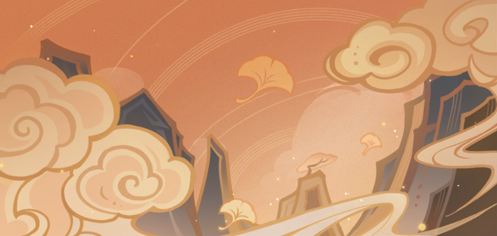
</a>

<a href="https://github.com/ryokr/Namecard/blob/main/Namecards/Event/UI_NameCardPic_Event58_P.png" target="_blank">
  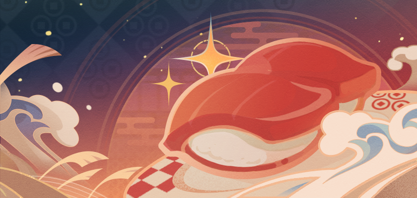
</a>
<a href="https://github.com/ryokr/Namecard/blob/main/Namecards/Event/UI_NameCardPic_Feast_II_P.png" target="_blank">
  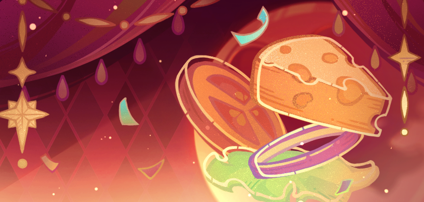
</a>

<a href="https://github.com/ryokr/Namecard/blob/main/Namecards/Event/UI_NameCardPic_HideandSeek_P.png" target="_blank">
  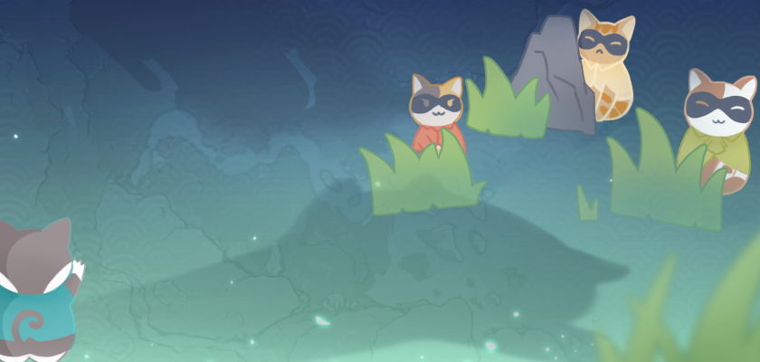
</a>

<a href="https://github.com/ryokr/Namecard/blob/main/Namecards/Event/UI_NameCardPic_RedandWhite_P.png" target="_blank">
  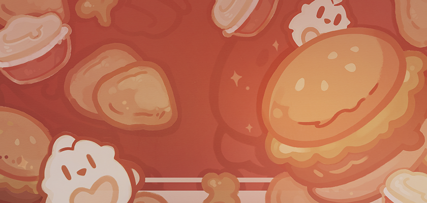
</a>
<a href="https://github.com/ryokr/Namecard/blob/main/Namecards/Event/UI_NameCardPic_Sumo_P.png" target="_blank">
  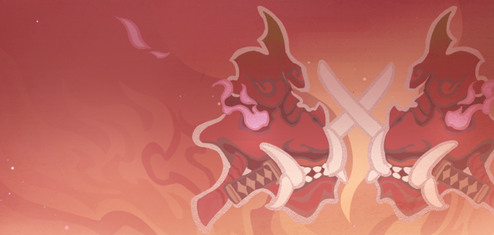
</a>
<a href="https://github.com/ryokr/Namecard/blob/main/Namecards/Event/UI_NameCardPic_TheatreMechanicus2_P.png" target="_blank">
  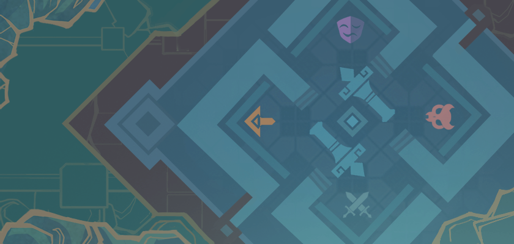
</a>
<a href="https://github.com/ryokr/Namecard/blob/main/Namecards/Event/UI_NameCardPic_TheatreMechanicus_P.png" target="_blank">
  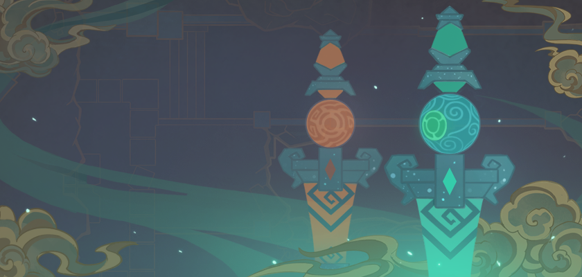
</a>
<a href="https://github.com/ryokr/Namecard/blob/main/Namecards/Event/UI_NameCardPic_TowerChallenge_P.png" target="_blank">
  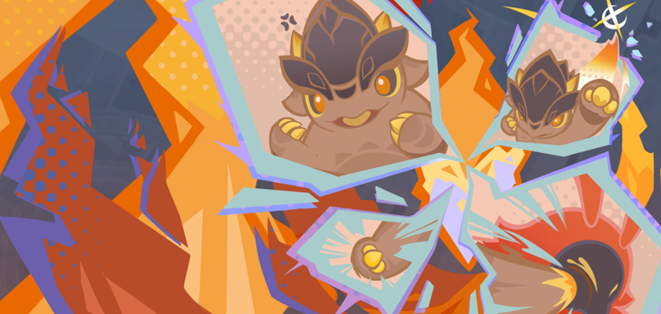
</a>
<a href="https://github.com/ryokr/Namecard/blob/main/Namecards/Event/UI_NameCardPic_YellowV2_P.png" target="_blank">
  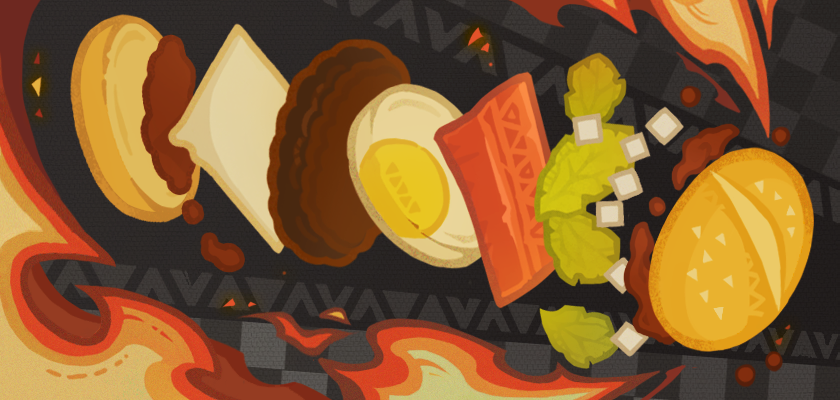
</a>

---

## 📂 Offering

<a href="https://github.com/ryokr/Namecard/blob/main/Namecards/Offering/UI_NameCardPic_KzsdOffering_P.png" target="_blank">
  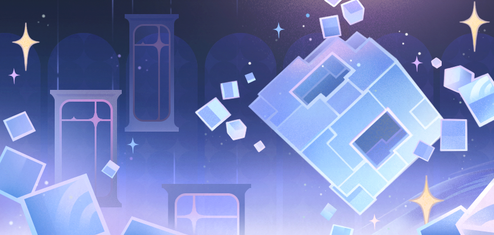
</a>

<a href="https://github.com/ryokr/Namecard/blob/main/Namecards/Offering/UI_NameCardPic_NatlanOffering_P.png" target="_blank">
  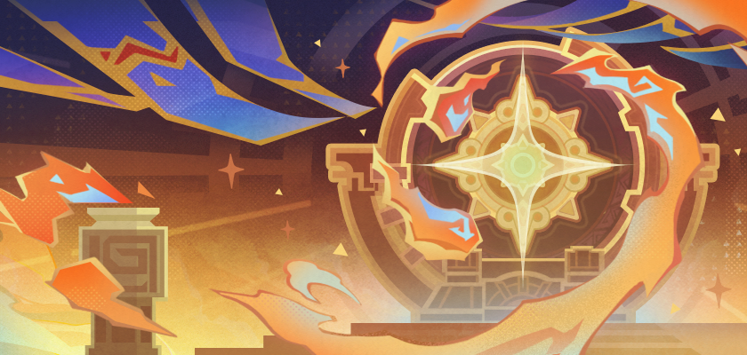
</a>

<a href="https://github.com/ryokr/Namecard/blob/main/Namecards/Offering/UI_NameCardPic_OfferingPari_P.png" target="_blank">
  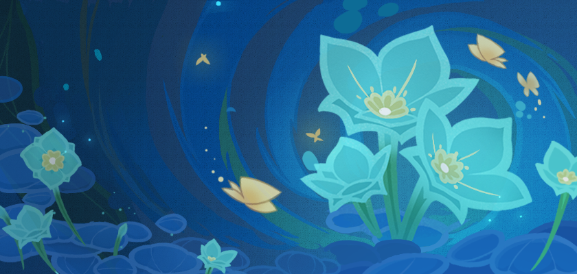
</a>

---

## 📂 Reputation

<a href="https://github.com/ryokr/Namecard/blob/main/Namecards/Reputation/UI_NameCardPic_Fontaine2_P.png" target="_blank">
  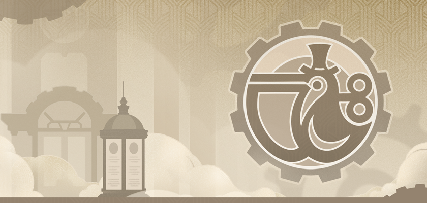
</a>
<a href="https://github.com/ryokr/Namecard/blob/main/Namecards/Reputation/UI_NameCardPic_Ly1_P.png" target="_blank">
  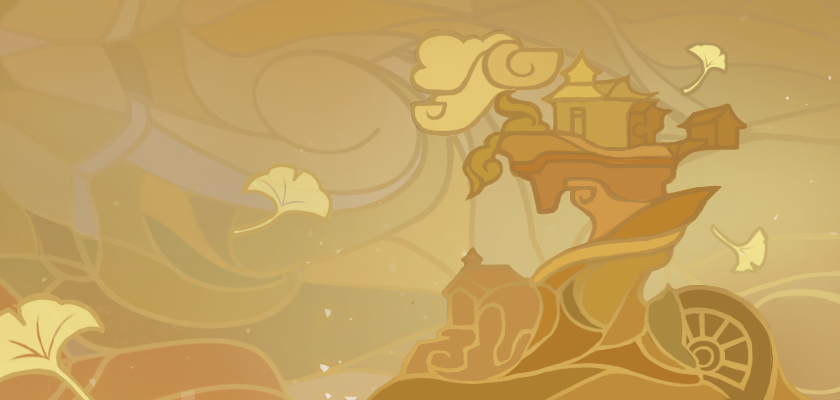
</a>
<a href="https://github.com/ryokr/Namecard/blob/main/Namecards/Reputation/UI_NameCardPic_Ly2_P.png" target="_blank">
  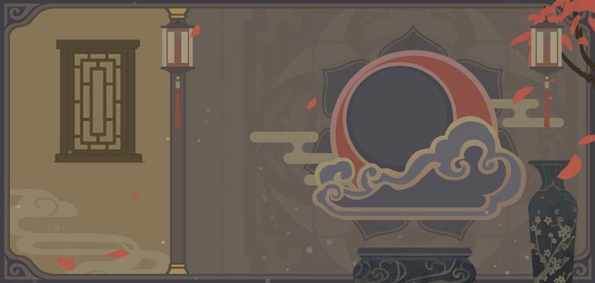
</a>
<a href="https://github.com/ryokr/Namecard/blob/main/Namecards/Reputation/UI_NameCardPic_Md1_P.png" target="_blank">
  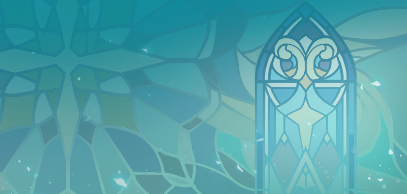
</a>
<a href="https://github.com/ryokr/Namecard/blob/main/Namecards/Reputation/UI_NameCardPic_Md2_P.png" target="_blank">
  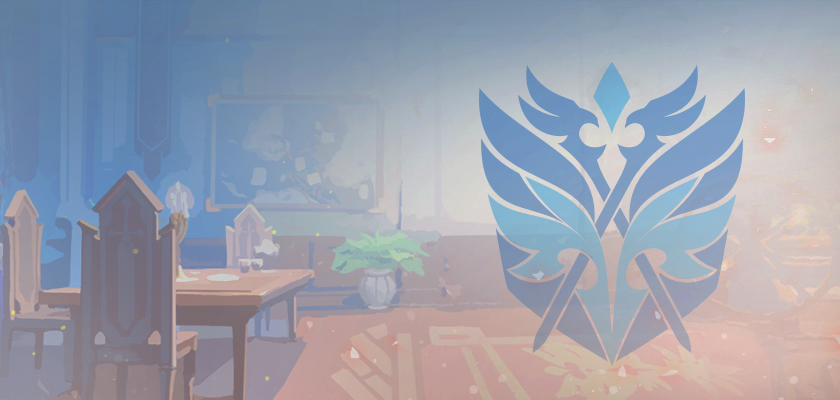
</a>

---

<!-- GALLERY-END -->
